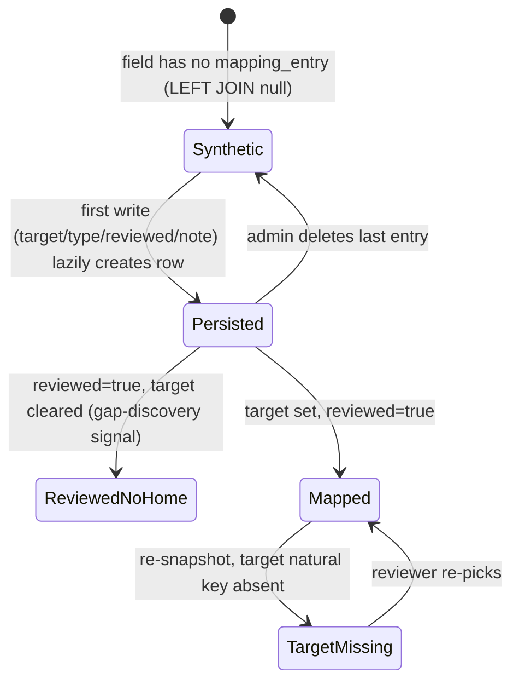

# feat: Cashline ⇄ Sailfin Mapping Workbench

## Overview

A new workbench inside this Rails 8 app (`cashline-ontology`) for mapping the extracted Sailfin (Salesforce AR) schema onto cashline-platform's forward-looking data model. The primary surface is a single sortable/filterable table — one row per mapping *edge* — where a reviewer sets a cashline target via picklist, accepts heuristic/embedding-based suggestions, captures mapping type + confidence + a `reviewed` flag + notes, and expands rows to map picklist values to enum values. The exported CSV feeds a downstream test-import loop (built in cashline-platform, out of scope here).

The cashline target is ingested as a JSON **snapshot** of cashline-platform's current Rails schema and is expected to evolve — the workbench surfaces gaps that feed back into the cashline design, then re-snapshots. Mappings reference targets by natural key so re-snapshotting doesn't silently orphan work.

## Problem Frame

cashline-platform is the *ideal* AR model, still being designed (currently a flat `invoices` table — no STI, no `ARPosting`). Sailfin data is an input to that design. Two needs drive the mapping: (1) **data sync** — pull/clean/import Sailfin data while both systems run; (2) **gap discovery** — surface actively-used Sailfin data that user interviews missed. Volume (~30+ objects, hundreds of fields, `sfsrm__Transaction__c` at 2.17M rows) makes manual mapping infeasible, so reviewer-supervised suggestions are core, not optional. See origin: `docs/brainstorms/2026-05-27-cashline-sailfin-mapping-workbench-requirements.md`.

## Requirements Trace

- R1 (M1): Snapshot cashline-platform's *current* schema via AR introspection (rake task → JSON + SHA-256). No STI/discriminator machinery.
- R2 (M1): Loader verifies hash, records an audit event, populates a single JSONB snapshot table.
- R3 (M1): Mappings reference targets by natural key `(class_name, field_name)`; re-snapshot flags missing targets for re-review.
- R4 (M1): A workbench session is `(sailfin_run_id, cashline_snapshot_id)`; the snapshot half is selectable.
- R5–R9 (M2): Single sortable/filterable mapping grid; data-group column; target picklist; suggest button; group-by-target; split grouping.
- R10–R13 (M3): Edge records with 6-value `mapping_type`, `reviewed` flag, audit on sensitivity downgrade.
- R14–R15 (M4): Structured picklist value-level mapping (no free text); value frequency surfaced.
- R16–R20 (M5): Heuristic matcher first; OpenAI+pgvector embeddings second; PII/financial transmission gate.
- R21–R23 (M6): Filter chips; gap-discovery view; bookmarkable URLs.
- R24–R26 (M7): CSV export (field-level + value companion), gated and audit-logged.
- R27–R31 (NFR): Mapping store in this app; `MappingEntryPolicy` with sensitivity scope; GoodJob jobs with progress; graceful OpenAI degradation; sunset.

## Scope Boundaries

- **Not** in v1: discriminator-conditional mapping (`applies_when`), STI / per-subtype handling, side-by-side panels, agent-as-host, Turtle export, value-level *LLM* suggestions, scheduled snapshot refresh, write-back to either app.
- **Not** authoring cashline classes/columns — those are migrations in cashline-platform, surfaced here via re-snapshot.
- **Not** resolving per-tenant/brand crosswalks globally — flagged `needs_crosswalk`, resolved per import.

### Deferred to Separate Tasks

- The **test-import loop** (importing the exported mapping into a cashline DB copy, assessing, refining): cashline-platform effort, consumes this plan's CSV contract.
- The **ongoing Sailfin → cashline sync engine**: later cashline-platform phase.
- **pgvector availability in the production Postgres image**: an infra/Kamal change (see Risks) that must land before Unit 10 deploys.

## Context & Research

### Relevant Code and Patterns

- **Grid UI substrate:** `app/views/objects/_fields_panel.html.erb` (sortable table + data-row/detail-row pairing contract), `app/javascript/controllers/sortable_table_controller.js`, `type_filter_controller.js`, `expandable_controller.js` (register new controllers in `app/javascript/controllers/index.js`). Filter state lives in URL params per `app/views/objects/index.html.erb`.
- **Field detail:** `app/views/objects/_field_detail_panel.html.erb`, `app/views/objects/field.html.erb`, `ObjectsController#field`.
- **CSV export:** `app/helpers/objects_helper.rb` — `fields_export_csv`, `CSV_HEADERS`, `MAPPING_PLACEHOLDERS`, PII redaction (omits `top_values`/`sample_values`). Simpler row-array variant: `ReportsController#csv_for`.
- **GoodJob pattern:** `app/jobs/extract_describe_job.rb` (`total_limit: 1`, chains next), `app/jobs/profile_object_job.rb` (`total_limit: 4`, `build_runner` test seam, `record_partial_failure!`), the `if respond_to?(:good_job_control_concurrency_with)` guard with `arguments.first` key, cron registration in `config/initializers/good_job.rb`.
- **Progress + live update:** `ExtractionRun#profile_progress`, `app/views/runs/_profile_progress.html.erb`, `ExtractionRun#broadcast_panel_update` (`after_update_commit` Turbo Streams).
- **Authorization:** `app/policies/sobject_policy.rb` (`Scope` joins `extraction_runs.include_sensitive`, fail-closed `scope.none` on nil user), `app/policies/field_sample_policy.rb` (per-value gate), controller conventions `verify_authorized` / `verify_policy_scoped`.
- **Session binding:** `app/controllers/concerns/active_run.rb` (`current_run`, `set_active_run_from_param` gates `?run=` through policy, `select_active_run!`). Mirror for `current_snapshot`.
- **Models:** `app/models/sfield.rb` (note `sensitivity` is a **string** column, not a Rails enum: `safe`/`pii`/`financial`/`pii_and_financial`/`unknown_sensitivity`; Salesforce help text lives in `raw_describe` jsonb, there is **no** `description` column), `app/models/field_profile.rb` (`null_rate`, `distinct_count`, `top_values` jsonb shaped `{value/v, count/c}`), `app/models/spicklist_value.rb` (`value`, `label`, `active`), `app/models/extraction_run.rb` (`record_partial_failure!` concurrency-safe jsonb append, `purgeable` retention sweep), `app/models/run_diff.rb` (`CATEGORIES` — reusable re-snapshot delta vocabulary).
- **Audit:** `AuditEvent.record!(user:, action:, subject:, params:, request:)` (`app/models/audit_event.rb`), separate append-only audit DB.
- **External-client seam:** `app/services/salesforce/client_factory.rb` (`module ... extend self`, `validate_credentials!`, reads `Rails.application.credentials`), `app/services/salesforce/token_cache.rb` (advisory-lock single-flight). Model the OpenAI client on these.
- **Sensitivity:** `app/services/ontology/sensitivity_classifier.rb` (fail-closed to `unknown_sensitivity`).
- **Existing related view:** `ReportsController#mapping_order` + `app/views/reports/mapping_order.html.erb` — the workbench should link to it, not duplicate it.

### Institutional Learnings

- `docs/solutions/integration-issues/extraction-pipeline-missing-terminal-step-2026-05-23.md` — a multi-job GoodJob pipeline passed all isolated unit tests but never wired its terminal step. **Directly applicable:** the embedding/proposal pipeline needs a terminal-state integration test asserting the union of final states (proposals persisted AND job marked complete AND grid reflects them), not just per-job unit tests.
- `docs/runbook/run-storage.md`, `docs/runbook/audit-db.md` — sensitive-data retention (30-day purge) and append-only audit conventions the workbench must respect (don't let sensitive-field embeddings outlive retention; audit any authorization to transmit sensitive data).

### External References

- `neighbor` gem (`~> 0.6`) over the pgvector Postgres extension; query via `nearest_neighbors(:embedding, distance: "cosine")`. Skip ANN index initially (hundreds of rows); add HNSW + `vector_cosine_ops` only if needed.
- OpenAI `text-embedding-3-small` (1536 dims, cosine, ~$0.02/1M tokens — negligible). Batch inputs as arrays. Thin Faraday client recommended over adding `ruby-openai`/`openai` gems (one endpoint, reuses existing faraday).
- OpenAI data-retention posture is legally uncertain (NYT litigation; ZDR is opt-in enterprise). Mitigation: embed **metadata only**, never field values; auth-gate transmission; audit by content hash. (Sources in origin research; verify current posture before first sensitive transmission.)

## Key Technical Decisions

- **Snapshot, not live introspection; natural-key target references.** Mirrors the existing extraction-run snapshot pattern, decouples the two apps, and absorbs the constantly-evolving cashline draft. `mapping_entries` reference `(class_name, field_name)` strings, never a surrogate FK into snapshot rows. (origin: Key Decisions)
- **Single JSONB snapshot table**, not three normalized tables. `cashline_snapshots(id, loaded_at, sha256, schema_json jsonb)`. The grid filters `mapping_entries` (relational rows); the JSONB is read mainly to build the target picklist and resolve natural keys.
- **Grid read-model = `sfields LEFT JOIN mapping_entries` UNION source-less `net_new` entries.** A never-touched field is a synthetic row with no DB record. The first write (target/type/reviewed/note) **lazily creates** a `mapping_entry`. Uniqueness key: `(cashline_snapshot_id, source_field_id, target_class, target_field)`, with the target-null case collapsed to one row per `source_field_id` per snapshot. (Resolves the origin's "Resolve Before Planning" item, per flow analysis.)
- **1:N split has no group key** — sibling rows are inferred by shared `source_field_id`; deleting back to a single edge auto-demotes `mapping_type` from `split` to `direct`.
- **Clear-target vs delete:** clearing a target on a reviewed row is an analyst edit that keeps the row (`reviewed=true`, null target — the gap-discovery signal). True row deletion (removing the last entry, deleting a `net_new` row) is admin-only.
- **Two orthogonal sensitivity dimensions — do not conflate them.** (1) *Run-level* `extraction_runs.include_sensitive` governs **grid/row visibility** (the `MappingEntryPolicy` scope, Unit 5). (2) *Field-level* `sfields.sensitivity` (`safe`/`pii`/`financial`/`pii_and_financial`/`unknown_sensitivity`) governs **what may be transmitted to OpenAI** (Unit 10) and **value-row display** (Unit 8). A non-sensitive run can contain an individual `pii` field (visible in the grid, but its content is not transmitted); a sensitive run can contain `safe` fields (scoped out of the grid for non-privileged users). Every unit that touches sensitivity must state which dimension it uses.
- **Sensitivity scope reaches the run via `source_field → sobject → extraction_run`.** Because `mapping_entries.source_field_id` is **nullable**, the scope must use a `LEFT JOIN`/subquery, NOT the plain `INNER JOIN` in `SobjectPolicy::Scope` (whose FK is NOT NULL) — an inner join would silently drop every `net_new` row. `net_new` rows (null source) are always visible. The scope propagates to the `mapping_value_entries` child query. (origin R28)
- **Sensitive fields are embedded as structural-metadata-only, unconditionally** — there is no "unless the user has `sensitive_data_access`" carve-out for *embeddings*. (The `sensitive_data_access` flag governs *viewing values*, not feeding the matcher.) This removes the cross-user cache hazard where the same field would hash to different descriptor text per actor and a privileged user's full-content embedding could leak into non-scoped proposals. Consequence: `pii`/`financial`/`unknown_sensitivity` (fail-closed) fields never have full-content embeddings cached, which also makes the retention story trivial for them.
- **Heuristic matcher (M5a) ships before embeddings (M5b).** Lexical/type/picklist-overlap matching is cheap, API-free, PII-safe, and handles the common lexical cases; embeddings are an additive signal only if heuristics leave a gap. (origin Key Decisions)
- **Embeddings: `neighbor` + `text-embedding-3-small` (1536, cosine), thin Faraday OpenAI client** modeled on `salesforce/client_factory.rb`, content-hash-keyed cache table so re-runs don't re-bill. Metadata-only transmission with a transmission-time sensitivity re-check.
- **`mapping_type` is a 6-value set** (`direct`/`value_collapse`/`split`/`derived`/`dropped`/`net_new`) plus a `reviewed` boolean — the previous `blocked`/`metadata_carry` states are covered by `reviewed=false` + empty target + a note.
- **Accept-suggestion persists immediately.** Clicking a suggest button calls `upsert_edge` to create/update the `mapping_entry` with the suggested target (it does NOT merely pre-fill a typeahead awaiting a separate save). This pins the Turbo-frame behavior and lazy-create timing — chosen now because the alternative (pre-fill-then-confirm) is a different controller contract that's expensive to swap later.
- **`net_new` rows sort to a pinned "(no source)" group at the bottom**, via an explicit sort key (not alphabetical on a blank Data Group). Reviewed-no-home rows are visually distinguished from never-reviewed rows (e.g., a faint "reviewed · no target" badge) so the gap-discovery signal is legible in the grid. (Other interaction details — split-affordance location, "show suppressed" placement, suggest-button empty/suppressed labels, reconciliation trigger wording — are resolve-while-building, not data-model-shaping.)
- **Terminology:** the data model / controller actions use `proposal` (`mapping_proposals`, `accept_proposal`); user-facing UI says "suggestion". Intentional split — keep it consistent within each layer.

## Open Questions

### Resolved During Planning

- **Grid write-model / uniqueness / split grouping / clear-vs-delete** → resolved (see Key Technical Decisions), per flow analysis defaults.
- **OpenAI client shape** → thin Faraday client, no new gem, modeled on the Salesforce client factory seam.
- **Vector storage** → `neighbor` gem + pgvector extension; no ANN index initially; content-hash-keyed embeddings cache table.
- **No-snapshot state** → `/mappings` renders a source-only grid usable for gap discovery, with an empty target picklist and a "load a snapshot to map" affordance (mirrors `ActiveRun`'s nil-run empty state).
- **Sensitive-field value sub-table** → scope out the whole child row for non-privileged users (consistent with `MappingEntryPolicy`), rather than per-cell redaction.
- **Rejection persistence** → suppressed proposals keyed by `(source_field_id, target_class, target_field)` independent of `cashline_snapshot_id`, so re-snapshot doesn't resurrect a rejected suggestion; a "show suppressed" affordance allows un-reject.

### Deferred to Implementation

- Exact OpenAI embedding batch size and retry/backoff tuning — depends on observed rate limits at the org's tier.
- The precise lexical/type/picklist signal weighting in the heuristic matcher — tune against the first real session's acceptance data and the first test-import results.
- Whether the `cashline_snapshots` JSONB needs any extracted/indexed columns for picklist-building performance — measure first; add only if slow at real field counts.
- The exact JSON Schema for the snapshot interface (versioned, shared across repos) and the final infra-table exclusion list — settle while building Units 1–2.

## High-Level Technical Design

> *This illustrates the intended approach and is directional guidance for review, not implementation specification. The implementing agent should treat it as context, not code to reproduce.*

Data model (new tables in this app's primary DB):

```mermaid
erDiagram
    EXTRACTION_RUN ||--o{ SOBJECT : has
    SOBJECT ||--o{ SFIELD : has
    SFIELD ||--o{ SPICKLIST_VALUE : has
    SFIELD ||--o{ FIELD_PROFILE : has
    CASHLINE_SNAPSHOT ||--o{ MAPPING_ENTRY : "target source-of-truth"
    SFIELD ||--o{ MAPPING_ENTRY : "source (nullable for net_new)"
    MAPPING_ENTRY ||--o{ MAPPING_VALUE_ENTRY : "picklist value rows"
    SFIELD ||--o{ MAPPING_PROPOSAL : "suggested targets"
    CASHLINE_SNAPSHOT ||--o{ MAPPING_PROPOSAL : "scoped to snapshot"
    SFIELD ||--o{ EMBEDDING_SOURCE : "back-ref for purge"
    EMBEDDING_SOURCE }o--|| EMBEDDING_CACHE : "links field→content hash"
    EMBEDDING_CACHE ..> MAPPING_PROPOSAL : "feeds signal (M5b, logical not FK)"

    MAPPING_ENTRY {
        bigint cashline_snapshot_id
        bigint source_field_id "nullable (net_new)"
        string target_class "natural key"
        string target_field "natural key"
        string mapping_type "direct|value_collapse|split|derived|dropped|net_new"
        string confidence
        boolean reviewed
        text transformation_note
        text source_citation
        boolean needs_crosswalk
    }
    MAPPING_VALUE_ENTRY {
        bigint mapping_entry_id
        string source_value
        string target_enum_value "natural key, or drop/derive"
        text notes
    }
    MAPPING_PROPOSAL {
        bigint source_field_id
        bigint cashline_snapshot_id
        string target_class
        string target_field
        float score
        jsonb signals "lexical|type|picklist|embedding"
        string state "open|accepted|rejected"
    }
```

Grid row lifecycle (one row per edge):



## Implementation Units

### Phase 1 — Snapshot foundation

- [x] **Unit 1: Cashline schema exporter (cashline-platform side)**

**Target repo:** cashline-platform (`/Users/stephenparslow/Sites/cashline-platform`)

**Goal:** A rake task that exports cashline-platform's current schema as JSON + a SHA-256 sidecar, for ingestion by this app.

**Requirements:** R1

**Dependencies:** None

**Files:**
- Create: `lib/tasks/cashline_export.rake` (task `cashline:export_schema`)
- Create: `app/services/cashline/schema_exporter.rb` (the introspection logic)
- Test: `test/services/cashline/schema_exporter_test.rb`

**Approach:**
- `Rails.application.eager_load!`, then introspect each `ApplicationRecord` descendant: table name, model namespace (directory), columns (name, sql_type, null, default, comment), Active Record enum mappings, associations (`belongs_to`/`has_many`/`has_one` with target class).
- Exclude infra tables (Active Storage, Solid*, GoodJob, `schema_migrations`, `ar_internal_metadata`, `audited`). Maintain an explicit exclusion list.
- Emit a top-level `schema_version` field and write `<timestamp>.json` plus `<timestamp>.json.sha256`.
- No STI handling in v1 (current schema is flat). Note in a code comment that STI/per-subtype applicability is a future extension.
- **cashline-platform uses `db/schema.rb` (Ruby format), not `structure.sql`** — but the exporter introspects live AR classes via `eager_load!`, so the schema format is irrelevant to the approach. **Caveat:** `column.comment` is usually empty on the cashline side (the inspected models don't set column comments), so the cashline descriptor text for embeddings (Unit 10) degrades to `api_name` + type. Don't assume rich help text exists on the target side.
- **Acknowledge the existing downstream consumer:** cashline-platform already has an `Ingestion::` mapping subsystem (`Ingestion::FieldMapping` with `source_column`/`target_path`/`target_type`/`transform_rule`, `Ingestion::MappingTemplate`, and an `Ingestion::Connector` `kind` enum that already includes `sailfin`). The exporter and the CSV contract (Unit 12) should be designed knowing this is where the mapping eventually lands — see Unit 12.

**Patterns to follow:** Mirror the clarity of this repo's `Salesforce::ClientFactory#validate_credentials!` for a clear error if introspection finds nothing.

**Test scenarios:**
- Happy path: exporting a schema with two models produces JSON containing both tables with their columns, enum maps, and associations.
- Happy path: the sidecar `.sha256` matches the JSON file's digest.
- Edge case: a model with an Active Record enum emits the enum's value→integer mapping.
- Edge case: infra tables (Active Storage, schema_migrations) are excluded from the output.
- Edge case: a namespaced model (`Customer::Account`) records its namespace/directory correctly.

**Verification:** Running `bin/rails cashline:export_schema` in cashline-platform writes a JSON+sidecar pair; the JSON lists every non-infra model with columns and associations.

- [x] **Unit 2: Snapshot model + loader (cashline-ontology side)**

**Goal:** Ingest the exporter's JSON into a single JSONB snapshot table, verifying integrity and auditing the load.

**Requirements:** R2, R3

**Dependencies:** Unit 1 (consumes its JSON; can be developed against a fixture)

**Files:**
- Create: `db/migrate/XXXX_create_cashline_snapshots.rb`
- Create: `app/models/cashline_snapshot.rb`
- Create: `lib/tasks/cashline.rake` (task `cashline:load_snapshot PATH=...`)
- Modify: `db/structure.sql` (regenerated)
- Test: `test/models/cashline_snapshot_test.rb`, `test/lib/tasks/cashline_load_snapshot_test.rb`

**Approach:**
- `cashline_snapshots(id, loaded_at, sha256, schema_json jsonb null:false default:{})`.
- Loader verifies the sidecar SHA-256 against the file before inserting; refuses on mismatch. On success records `AuditEvent.record!(action: "cashline_snapshot.loaded", user: nil, params: {path:, sha256:})`.
- Model exposes helpers to enumerate classes/fields/enums from `schema_json` for the picklist and natural-key resolution. **Define an explicit contract** for the lookup `Unit 8` and `Unit 6` depend on: `CashlineSnapshot#field(class_name, field_name)` returning the field's type and (if enum-bearing) its enum values, plus `#enum_bearing?(class_name, field_name)`. This is the seam between the JSONB shape and the value sub-table — settle it here, not in Unit 8.

**Patterns to follow:** JSONB column convention from `db/migrate/...create_field_profiles.rb`; `AuditEvent.record!` signature; SQL schema regeneration.

**Test scenarios:**
- Happy path: loading a valid JSON+sidecar creates a `CashlineSnapshot` whose `schema_json` round-trips the file.
- Happy path: a `cashline_snapshot.loaded` audit event is written with the path and hash.
- Error path: a tampered JSON (hash mismatch) raises and inserts nothing.
- Error path: a missing sidecar file raises a clear configuration error.
- Edge case: `CashlineSnapshot#classes`/`#fields_for(class_name)` enumerate the JSONB correctly, including enum-bearing fields.

**Verification:** `bin/rails cashline:load_snapshot PATH=fixture.json` creates a snapshot, writes an audit event, and rejects a hash-mismatched file.

- [x] **Unit 3: Snapshot selection (`CurrentSnapshot` concern + UI)**

**Goal:** Let a user select an active cashline snapshot, mirroring how `ExtractionRun` selection works, so a workbench session is `(sailfin_run_id, cashline_snapshot_id)`.

**Requirements:** R4

**Dependencies:** Unit 2

**Files:**
- Create: `app/controllers/concerns/current_snapshot.rb`
- Create: `app/policies/cashline_snapshot_policy.rb`
- Create: `app/controllers/cashline_snapshots_controller.rb` (index + select)
- Modify: `config/routes.rb`
- Modify: `app/views/shared/_nav.html.erb` (active-snapshot badge alongside active-run)
- Create: `app/views/cashline_snapshots/index.html.erb`
- Test: `test/controllers/cashline_snapshots_controller_test.rb`, `test/policies/cashline_snapshot_policy_test.rb`

**Approach:**
- **Lean v1:** a `current_snapshot` helper that resolves `?snapshot=` (gated through `CashlineSnapshotPolicy#show?`) else the most-recent snapshot, with a nil-safe empty state. There will be exactly one snapshot until the cashline schema first changes, so the full `ActiveRun`-style session-storage + selection UI + nav badge is **deferred to Unit 3b** (gated on a second snapshot actually existing). This keeps the full `CurrentSnapshot` machinery off the critical path to the first grid.
- A bookmarked session resolves against its frozen `cashline_snapshot_id`; the explicit "use latest snapshot" rebind action (and the reconciliation it triggers) lands with Unit 3b / Unit 11b.

**Patterns to follow:** `app/controllers/concerns/active_run.rb` (template for the deferred Unit 3b), `RunsController#select`.

**Test scenarios:**
- Happy path: `current_snapshot` returns the most-recent snapshot when none is explicitly selected.
- Happy path: `?snapshot=` selects a specific snapshot, gated through the policy.
- Edge case: with no snapshot loaded, `current_snapshot` is nil and `/mappings` renders the source-only empty state (Unit 6).
- Integration: `?snapshot=N` resolves the grid against snapshot N.

**Verification:** The grid resolves a current snapshot (latest or `?snapshot=`), and degrades cleanly to nil. Full selection UI is Unit 3b.

> **Unit 3b (deferred, gated on a second snapshot existing):** the full `CurrentSnapshot` concern (`session[:active_snapshot_id]`, `select_active_run!`-style writer), `CashlineSnapshotsController` (index + select), nav badge, and the "use latest / rebind" action. Mirror `ActiveRun` exactly.

### Phase 2 — Mapping core

- [x] **Unit 4: Mapping data model (`mapping_entries`, `mapping_value_entries`)**

**Goal:** Persist mapping edges and their picklist value rows, with the uniqueness and lifecycle rules from the Key Technical Decisions.

**Requirements:** R10, R11, R12, R14 (schema)

**Dependencies:** Unit 2

**Files:**
- Create: `db/migrate/XXXX_create_mapping_entries.rb`
- Create: `db/migrate/XXXX_create_mapping_value_entries.rb`
- Create: `app/models/mapping_entry.rb`
- Create: `app/models/mapping_value_entry.rb`
- Modify: `db/structure.sql`
- Test: `test/models/mapping_entry_test.rb`, `test/models/mapping_value_entry_test.rb`

**Approach:**
- `mapping_entries`: `cashline_snapshot_id`, `source_field_id` (nullable, FK to `sfields`), `target_class`, `target_field` (natural-key strings, nullable), `mapping_type` (string, 6-value), `confidence` (string), `reviewed` (boolean default false), `transformation_note` (text), `source_citation` (text), `needs_crosswalk` (boolean default false).
- **One canonical row per source for the "unmapped / reviewed-no-home" state.** A field that's been looked at but has no target is a single row with `reviewed=true`, null target. **Split legs always carry a target** — an in-progress blank split leg is held client-side and persisted only once a target is chosen. This removes the index contradiction a naive design hits (a reviewed-no-home row and a blank split leg both being null-target rows for the same source).
- Indexes: (a) partial unique on `(cashline_snapshot_id, source_field_id, target_class, target_field) WHERE target_class IS NOT NULL` — one row per concrete edge; (b) partial unique on `(cashline_snapshot_id, source_field_id) WHERE target_class IS NULL` — the single canonical null-target row per source. Together these allow N targeted rows (splits/collapses) plus at most one null-target row per source — and forbid the contradiction.
- `mapping_value_entries`: `mapping_entry_id`, `source_value`, `target_enum_value` (natural key, or sentinel for drop/derive), `notes`. The `source_value` is a raw string (tolerates undeclared in-data values not in `spicklist_values`).
- Validations: `source_citation` presence when `mapping_type = net_new` (enforced at export, not create — see Unit 12); `source_field_id` null only when `mapping_type = net_new`.
- **Write path:** an `upsert_edge` class method wraps `find_or_create_by` on the uniqueness key with a rescue-retry on `RecordNotUnique` (Rails `find_or_create_by` is not atomic against the unique index). This method — not the controller — owns the concurrency handling. The controller (Unit 7) calls it.
- **Split semantics:** `split_siblings` = other entries sharing `source_field_id` **that have a target** (excludes the canonical null-target/reviewed-no-home row, so that row never counts toward split membership). `demote_if_single_split`: when a `split` entry's `split_siblings` drops to one *targeted* row, demote the survivor to `direct`; never demote a null-target row to `direct` (it stays the reviewed-no-home gap signal).

**Patterns to follow:** migration + index conventions in `db/migrate/...create_field_profiles.rb` (composite + partial unique index — see the `WHERE cron_key IS NOT NULL` partial-unique precedent in `db/structure.sql`); concurrency-safe write guidance from `ExtractionRun#record_partial_failure!`.

**Test scenarios:**
- Happy path: creating a `direct` mapping with a target persists and is findable by source field.
- Edge case: a second entry for the same source+target violates the targeted-edge unique index.
- Edge case: a second null-target row for the same source+snapshot violates the null-target partial unique index (the canonical row collapses).
- Edge case: a reviewed-no-home row (null target) and a targeted split leg for the *same* source coexist without violating either index.
- Edge case: a `net_new` entry persists with null `source_field_id`.
- Edge case: deleting one leg of a 2-leg split (both targeted) demotes the surviving `split` entry to `direct`.
- Edge case: deleting a split leg when a reviewed-no-home row also exists for that source does NOT demote/relabel the null-target row.
- Edge case: a ranking/uniqueness race — two concurrent `upsert_edge` calls for the same key produce one row, not a `RecordNotUnique` crash.
- Integration: a `mapping_value_entry` with an undeclared `source_value` (string not in `spicklist_values`) persists and associates to its parent.

**Verification:** The model enforces edge uniqueness, allows reviewed-no-home + split to coexist, demotes only targeted single-splits, and `upsert_edge` is concurrency-safe.

- [x] **Unit 5: `MappingEntryPolicy` + sensitivity scope**

**Goal:** Authorize mapping reads/writes and ensure mappings touching sensitive-run Sailfin fields are invisible to users without `sensitive_data_access`.

**Requirements:** R28

**Dependencies:** Unit 4

**Files:**
- Create: `app/policies/mapping_entry_policy.rb`
- Create: `app/policies/mapping_value_entry_policy.rb`
- Test: `test/policies/mapping_entry_policy_test.rb`, `test/policies/mapping_value_entry_policy_test.rb`

**Approach:**
- `Scope#resolve`: `scope.none` if no user; full scope if `user.sensitive_data_access?`; else exclude entries whose source field belongs to a sensitive run. **Because `source_field_id` is nullable, this must NOT copy `SobjectPolicy::Scope`'s plain `joins(:extraction_run)` (that FK is NOT NULL there; an inner join here silently drops every `net_new` row).** Use `where("source_field_id IS NULL OR source_field_id NOT IN (?)", Sfield.joins(sobject: :extraction_run).where(extraction_runs: { include_sensitive: true }).select(:id))` or an equivalent LEFT JOIN. `net_new` rows (null `source_field_id`) stay visible.
- This scope gates **grid/row visibility** via the *run-level* `include_sensitive` dimension (not the per-field `sfields.sensitivity` — that governs transmission/value-display in Units 10/8). See Key Technical Decisions.
- Action methods: `analyst` → create/update; `read_only` → view; `admin` → destroy.
- Value-entry scope inherits the parent's visibility (join through `mapping_entry`), with the same null-source-safe filter so children of `net_new` parents stay visible.

**Patterns to follow:** `app/policies/sobject_policy.rb` (`Scope`), `app/policies/field_sample_policy.rb`.

**Test scenarios:**
- Happy path: an analyst can create/update; read_only cannot; admin can destroy.
- Edge case: a user without `sensitive_data_access` does not see a mapping whose source field belongs to a sensitive run.
- Edge case: a `net_new` mapping (no source) is visible to all authenticated users.
- Integration: the value-entry scope hides child rows whose parent's source field is sensitive, for non-privileged users.

**Verification:** Policy specs confirm role gating and that the sensitivity join filters both parent and child rows; `net_new` rows stay visible.

- [x] **Unit 6: Mapping grid (controller + view + Stimulus reuse)**

**Goal:** Render the single sortable/filterable grid with the data-group column, target picklist, and suggest-button slot; usable even with no snapshot.

**Requirements:** R5, R6, R8, R9

**Dependencies:** Units 3, 4, 5

**Files:**
- Create: `app/controllers/mappings_controller.rb` (`index`)
- Create: `app/views/mappings/index.html.erb`
- Create: `app/views/mappings/_grid.html.erb`, `app/views/mappings/_row.html.erb`
- Create: `app/javascript/controllers/mapping_target_controller.js` (typeahead picklist)
- Modify: `app/javascript/controllers/index.js`
- Modify: `config/routes.rb`
- Test: `test/controllers/mappings_controller_test.rb`, `test/system/mapping_grid_test.rb`

**Approach:**
- `index` materializes the read-model: `sfields` for the active sailfin run LEFT JOIN `mapping_entries` (for the active snapshot) UNION source-less `net_new` entries. Apply `policy_scope`.
- Columns: Data Group (Sailfin cluster), Sailfin Object, Sailfin Field, Population (`field_profiles` null %/distinct), Mapping Type, Target (picklist), Confidence, Reviewed, Notes, suggest-button slot.
- Reuse `sortable-table`, `type-filter`, `expandable` controllers and the data-row/detail-row pairing contract. Target picklist is typeahead-filtered from `current_snapshot` classes/fields, grouped by namespace.
- Empty states: no snapshot → source-only grid + "load a snapshot to map" affordance; no sailfin run → existing nil-run empty state.

**Patterns to follow:** `app/views/objects/_fields_panel.html.erb`, `app/views/objects/index.html.erb` (URL-param filters), `ObjectsController#index` (policy_scope + verify hooks).

**Test scenarios:**
- Happy path: the grid lists every Sailfin field for the active run with its current mapping (or empty) for the active snapshot.
- Happy path: the target picklist contains the snapshot's classes/fields grouped by namespace.
- Edge case: with no snapshot loaded, the grid renders source-only with a disabled/empty target picklist and a load affordance.
- Edge case: a `net_new` row (no source) renders in a "(no source)" group.
- Edge case (sensitivity): a non-privileged user does not see rows for sensitive-run fields (policy_scope).
- Integration: sorting by a column keeps any expanded detail row paired with its parent.

**Verification:** `/mappings` renders the grid against the active run+snapshot, reuses the existing table interactions, and degrades to source-only with no snapshot.

- [x] **Unit 7: Mapping edit actions (set target/type/confidence/reviewed/notes, split, delete)**

**Goal:** Persist edits via lazy-create, with clear-vs-delete semantics, the split affordance, admin-only delete, and audit on sensitivity downgrade.

**Requirements:** R7 (apply target), R10, R12, R13

**Dependencies:** Unit 6

**Files:**
- Modify: `app/controllers/mappings_controller.rb` (`create`/`update`/`destroy`/`split`)
- Modify: `app/views/mappings/_row.html.erb` (inline edit affordances, Turbo)
- Modify: `config/routes.rb`
- Test: `test/controllers/mappings_controller_test.rb` (extend)

**Approach:**
- First edit on a synthetic row lazily creates the `mapping_entry` (find_or_create on the uniqueness key).
- Clearing a target on a reviewed row keeps the row (reviewed, null target). True deletion is `admin`-only and routes through `destroy`.
- `split` action creates a second entry for the same `source_field` (blank target, `mapping_type=split`); collapsing back demotes per Unit 4.
- On changing `mapping_type` to `dropped` for a `pii`/`financial` source field, write `AuditEvent.record!(action: "mapping.sensitivity_downgrade", ...)` with old/new type and sensitivity.
- Setting a target already claimed by another source is allowed (intentional N:1) but the row shows a non-blocking "also mapped from N fields" indicator.

**Execution note:** Add an integration test for the lazy-create + uniqueness path first — concurrent first-writes are a known hazard (see `ExtractionRun#record_partial_failure!`).

**Patterns to follow:** Turbo Frame inline updates as in `objects/field.html.erb`; `AuditEvent.record!` usage in `RunsController`.

**Test scenarios:**
- Happy path: setting a target on a synthetic row creates a `direct` mapping.
- Happy path: toggling `reviewed` on a row with no target persists a reviewed/no-target row (gap signal).
- Edge case: clearing a target on a reviewed row keeps the row; it does not delete.
- Edge case: an analyst cannot destroy a row; an admin can.
- Error path: a concurrent double first-write produces one row, not two (unique index + find_or_create).
- Integration: setting `mapping_type=dropped` on a PII field writes a `mapping.sensitivity_downgrade` audit event with old/new values.
- Integration: pointing a second source at an existing target surfaces the N:1 indicator and does not error.

**Verification:** All edit paths persist correctly, the clear/delete boundary holds, split create/collapse works, and sensitivity downgrades are audited.

### Phase 3 — Picklist value mapping

- [x] **Unit 8: Picklist value-level mapping (M4)**

**Goal:** Let a reviewer map source picklist values to target enum values in a structured sub-table, with frequency context and sensitivity scope-out.

**Requirements:** R14, R15

**Dependencies:** Units 4, 5, 7

**Files:**
- Modify: `app/controllers/mappings_controller.rb` (value-entry actions) or create `app/controllers/mapping_value_entries_controller.rb`
- Create: `app/views/mappings/_value_table.html.erb`
- Create: `app/javascript/controllers/value_map_controller.js` (per-value typeahead)
- Modify: `app/javascript/controllers/index.js`
- Test: `test/controllers/mapping_value_entries_test.rb`, `test/system/value_mapping_test.rb`

**Approach:**
- Row expands (reuse `expandable`) to a sub-table when the source field is a picklist and the target field is enum-bearing.
- Source rows: declared `spicklist_values` plus undeclared in-data values observed in `field_profiles.top_values`, each annotated with in-data frequency. Dead values (no frequency) visually de-prioritized.
- Each source value gets a typeahead picker of target enum values (handles large enums) plus `drop`/`derive` sentinels; persists a `mapping_value_entry`.
- For sensitive source fields, non-privileged users do not see the value sub-table at all (scoped out per Unit 5), consistent with the policy boundary.

**Patterns to follow:** `app/views/objects/_field_detail_panel.html.erb` (picklist + top-values rendering, `redacted_cell`), `expandable_controller.js`.

**Test scenarios:**
- Happy path: mapping source value `"Submitted"` → enum `submitted` persists a value entry.
- Happy path: declared values render with their in-data frequency; values absent from `top_values` show as low-priority.
- Edge case: an undeclared in-data value (in `top_values`, not in `spicklist_values`) gets a mappable row keyed by its raw string.
- Edge case: a source value mapped to `drop` persists with the drop sentinel.
- Edge case: a target enum with hundreds of values uses a typeahead, not a giant dropdown.
- Edge case (sensitivity): a non-privileged user cannot expand the value sub-table for a sensitive field.
- Edge case: a picklist field with no `field_profile` shows declared values with no frequency rather than erroring.

**Verification:** Value-level mappings persist as structured records, frequencies surface, large enums stay usable, and sensitive value rows are scoped out.

### Phase 4 — Suggestions

- [x] **Unit 9: Heuristic matcher + proposals (M5a)**

**Goal:** Compute API-free candidate mappings (lexical/type/picklist-overlap) and surface them as a one-click suggest button with accept/reject/suppress.

**Requirements:** R16, R18, R19

**Dependencies:** Units 4, 6, 7

**Files:**
- Create: `db/migrate/XXXX_create_mapping_proposals.rb`
- Create: `app/models/mapping_proposal.rb`
- Create: `app/services/mapping/heuristic_matcher.rb`
- Create: `app/jobs/compute_mapping_proposals_job.rb`
- Modify: `app/models/cashline_snapshot.rb` (proposal progress hash + broadcast)
- Modify: `app/controllers/mappings_controller.rb` (`accept_proposal`/`reject_proposal`)
- Modify: `app/views/mappings/_row.html.erb` (suggest button states)
- Modify: `db/structure.sql`
- Test: `test/services/mapping/heuristic_matcher_test.rb`, `test/jobs/compute_mapping_proposals_job_test.rb`, `test/controllers/mappings_controller_test.rb` (extend)

**Approach:**
- `mapping_proposals`: `source_field_id`, `cashline_snapshot_id`, `target_class`, `target_field`, `score`, `signals` (jsonb), `state` (`open`/`accepted`/`rejected`). Rejections keyed by `(source_field_id, target_class, target_field)` independent of snapshot. **The recompute job MUST filter newly-computed candidates against the rejection set before persisting `state='open'`** — otherwise a re-snapshot re-surfaces rejected suggestions. (Note: a *renamed* target changes the natural-key strings, so a rejection on the old name won't suppress the new name; flag this interaction to Unit 11b.)
- `HeuristicMatcher` scores candidates by token/lexical similarity on `(api_name, label)`, data-type compatibility, and picklist-value overlap; stores top-N per source field. Suppress on `net_new` targets; down-weight dead picklist values. **The weighting must have a testable definition of "correct" before it's finalized** — at minimum, a case where the right answer is NOT the top pure-lexical match (e.g., a type-compatible, picklist-overlapping candidate outranks a closer string match). The exact weights are tuned later (Deferred to Implementation), but the ranking contract is testable now.
- Job runs per `(sailfin_run, snapshot)` with the `good_job_control_concurrency_with` guard (`total_limit: 1` per snapshot); records per-field partial failures (mirror `record_partial_failure!`).
- Suggest button per row: disabled/spinner while computing; suppressed on already-reviewed rows; shows the top candidate label; clicking applies it into the picklist. Accept marks `accepted` + sets target; reject marks `rejected` + suppresses; a "show suppressed" affordance un-rejects.
- A per-session acceptance counter is displayed (secondary signal).

**Execution note:** Write the terminal-state integration test first (job completes AND proposals persisted AND grid renders suggest buttons) — per the documented pipeline-terminal-step gotcha in `docs/solutions/`.

**Patterns to follow:** `app/jobs/profile_object_job.rb` (concurrency guard, `build_runner` test seam, partial failures), `ExtractionRun#profile_progress` + `broadcast_panel_update`.

**Test scenarios:**
- Happy path: the matcher proposes `invoice_number` for `Invoice_Number__c` (lexical) above unrelated candidates.
- Ranking: a type-compatible + picklist-overlapping candidate outranks a closer pure-string match (proves the weighting, not just exact-match).
- Happy path: clicking the suggest button immediately persists the mapping (via `upsert_edge`) with the proposed target.
- Edge case: proposals are suppressed for `net_new` targets and down-weighted for dead picklist values.
- Edge case: rejecting a proposal suppresses it; "show suppressed" reveals it.
- Integration: after a re-snapshot recompute, a previously-rejected `(source, target_class, target_field)` is NOT re-emitted as `open` (asserted across an actual recompute on a new snapshot, not a same-snapshot reject/show cycle).
- Edge case: a suggest button on a still-computing session renders a disabled/loading state.
- Error path: a per-field matcher failure is recorded as a partial failure, not a silent empty button.
- Integration (terminal state): after the job runs, the proposals table is populated, the job is marked complete, and the grid shows suggestions — asserted together.

**Verification:** Heuristic proposals compute, surface per row, and accept/reject/suppress behaves correctly with rejection surviving re-snapshot.

- [x] **Unit 10: OpenAI embeddings + pgvector (M5b)**

**Goal:** Add embedding-based candidate generation as an additional proposal signal, with a strict metadata-only PII/financial transmission gate.

**Requirements:** R17, R19, R20, R30

**Dependencies:** Unit 9

**Files:**
- Modify: `Gemfile` (`neighbor`)
- Create: `db/migrate/XXXX_enable_vector_extension.rb`
- Create: `db/migrate/XXXX_create_embedding_caches.rb` (content-hash-keyed, vector column)
- Create: `db/migrate/XXXX_create_embedding_sources.rb` (back-reference: sfield ↔ content hash)
- Create: `app/models/embedding_cache.rb`, `app/models/embedding_source.rb`
- Create: `app/services/openai/client_factory.rb`, `app/services/openai/embeddings.rb`
- Create: `app/jobs/compute_embeddings_job.rb`
- Modify: `app/services/mapping/heuristic_matcher.rb` or a combiner that merges embedding similarity into `mapping_proposals.signals`
- Modify: `db/structure.sql`
- Test: `test/services/openai/embeddings_test.rb`, `test/jobs/compute_embeddings_job_test.rb`, `test/services/mapping/embedding_signal_test.rb`

**Gating:** This unit is a **decision gate, not a scheduled commitment.** Build it only after Units 1–9 + export ship and one real object has run through the test-import loop showing the heuristic matcher (M5a) leaves a meaningful gap. The requirements frame embeddings as conditional ("adds value *if* M5a leaves gaps") and note they're weak on managed-package names. Committing the pgvector image, OpenAI client, cache, and sensitivity-purge surfaces — for a sunset tool — is only justified once the gap is demonstrated.

**Approach:**
- `embedding_caches`: `content_sha256` (unique), `embedding` (vector(1536)), `created_at`. **Drop the speculative `model`/`dims` columns** — one model (`text-embedding-3-small`/1536) is in scope; add them only if a second model arrives. `find_or_create` by hash so re-runs don't re-bill. No ANN index initially (hundreds of rows); add HNSW + `vector_cosine_ops` later if needed.
- `embedding_sources`: `sfield_id`, `content_sha256` — the **back-reference that makes purge tractable** (the cache alone is hash-keyed and can't be purged by field). On sensitivity upgrade for a field, delete its `embedding_sources` rows and any orphaned `embedding_caches`.
- `OpenAI::ClientFactory` reads `Rails.application.credentials.openai`, `validate_credentials!`, thin Faraday POST to `/v1/embeddings`, batched array inputs. Injectable via a `build_*` seam for tests.
- Descriptor text per field = `(api_name, label, data_type)` + help text from `raw_describe` (Sailfin) / column comment (cashline, usually empty — see Unit 1). **Never field values.**
- **PII/financial gate (uses the field-level dimension; see Key Decisions):** `pii`/`financial`/`unknown_sensitivity` (fail-closed) fields are embedded as **structural-metadata-only, unconditionally** — there is NO `sensitive_data_access` carve-out for embeddings. This avoids the cross-user cache hazard (same field hashing to different descriptor text per actor) and prevents a privileged user's full-content embedding from leaking into the non-sensitivity-scoped `mapping_proposals`. Re-check sensitivity **at job execution** from the current `sfield.sensitivity`, not a job-enqueue parameter. The job runs under no request context — if no authorizing user is associated, fail closed (metadata-only for any non-`safe` field).
- On sensitivity *upgrade* (`safe` → sensitive), purge that field's `embedding_sources` + orphaned `embedding_caches` (mirror `ExtractionRun#purgeable`).
- Nearest-neighbor (`neighbor`, cosine) produces candidate targets merged into `mapping_proposals.signals.embedding`; the combined score reranks candidates. Graceful degradation: if OpenAI/credentials are unavailable, proposals fall back to heuristic-only (Unit 9).

**Execution note:** Confirm pgvector is available in the deploy Postgres image before this unit ships (see Risks). Verify the `vector` extension + column round-trips through `db/structure.sql` in CI (use a dedicated `enable_vector_extension` migration first so the extension exists before any vector column).

**Patterns to follow:** `app/services/salesforce/client_factory.rb` + `token_cache.rb` (client seam, credentials, single-flight), `app/jobs/profile_object_job.rb` (concurrency + test seam).

**Test scenarios:**
- Happy path: an embedding for a descriptor is computed once and cached; a second request with identical content hits the cache (no API call).
- Happy path: embedding nearest-neighbor adds a candidate that lexical matching missed, raising its combined score.
- Edge case (PII gate): a `pii` field is embedded as structural-metadata-only — its label/help-text are NOT transmitted — regardless of the acting user (no carve-out).
- Edge case: `unknown_sensitivity` is treated as sensitive (fail-closed); a job with no authorizing user also fails closed.
- Edge case: sensitivity upgrade deletes the field's `embedding_sources` and orphaned cache rows (asserts the back-reference lookup, not just that a purge ran).
- Error path: OpenAI unavailable → job degrades to heuristic-only without failing the grid.
- Integration: the transmission gate is evaluated at job execution from the current sensitivity attribute, not a job-enqueue parameter.
- Integration (audit): a sensitive-field transmission that IS authorized (if ever introduced) writes a `mapping.sensitive_transmission` audit event with field id + content hash — terminal-step wiring asserted, per the documented pipeline-gotcha.

**Verification:** Embedding signals enrich proposals, the cache prevents re-billing, sensitive fields are metadata-only with no cross-user leak, and the back-referenced purge is implementable.

### Phase 5 — Filters, discovery, export

- [x] **Unit 11a: Filter chips + gap-discovery view (M6) — ships in the mapping-core phase**

**Goal:** Add the grid filter chips and the gap-discovery saved view (the requirements' stated *primary early* use). Pull this forward — it depends only on the grid + edit + population column, not on suggestions or reconciliation.

**Requirements:** R21, R22, R23

**Dependencies:** Units 6, 7 (and the Population column); the `has_suggestion` chip soft-depends on Unit 9 (renders empty until proposals exist)

**Files:**
- Modify: `app/controllers/mappings_controller.rb` (filter params)
- Modify: `app/views/mappings/index.html.erb` (chips)
- Test: `test/controllers/mappings_controller_test.rb` (filters)

**Approach:**
- URL-param chips: `reviewed`/`unreviewed`, `mapped`/`unmapped`, `net_new`, `needs_crosswalk`, `has_suggestion`, and `mapping_type`. Reuse the `/objects` chip pattern. (Target-structure-specific chips — by subtype/state lane — stay deferred until such a structure exists.)
- Gap-discovery view: a saved filter for high `field_profiles` population AND `reviewed=true` AND no resolved target (the discriminating signal — NOT raw "unmapped", since every field starts unmapped). Plus an "unreviewed, high-population" worklist to prioritize review.

**Patterns to follow:** `ObjectsController#index` filter chips.

**Test scenarios:**
- Happy path: `?reviewed=false` returns only unreviewed rows; combining chips intersects.
- Happy path: the gap-discovery filter returns a reviewed, high-population, no-home field and excludes never-reviewed fields.
- Edge case: filters are bookmarkable (round-trip via URL params).
- Edge case: `has_suggestion` renders cleanly (empty result) before Unit 9 exists.

**Verification:** Chips filter and bookmark correctly; gap-discovery discriminates reviewed-no-home from never-reviewed.

- [ ] **Unit 11b: Re-snapshot reconciliation (gated on the first real re-snapshot)**

**Goal:** Surface field- and value-level breakage when the cashline snapshot changes. A *minimal* target-missing badge ships earlier with the grid (Unit 6); this unit adds the richer categorized reconciliation.

**Requirements:** R3 (reconciliation surface)

**Dependencies:** Units 6, 8, 11a; **gated on a second snapshot actually existing** (no consumer until the cashline schema changes once)

**Files:**
- Modify: `app/controllers/mappings_controller.rb` (reconciliation on snapshot rebind)
- Modify: `app/views/mappings/index.html.erb` (reconciliation banner)
- Create: `app/services/mapping/snapshot_reconciler.rb`
- Test: `test/services/mapping/snapshot_reconciler_test.rb`

**Approach:**
- Note: Unit 6 already ships a *minimal* per-row "target no longer in active snapshot" badge (a natural-key resolution miss is a cheap check). This unit adds the categorized banner.
- `SnapshotReconciler`: on snapshot rebind, compute targets now missing/renamed/type-changed and enum values removed/renamed, reusing the **`RunDiff::CATEGORIES` constant** (the vocabulary only — `RunDiff` itself is tied to `ExtractionRun` FKs). Flag affected `mapping_entries` (`reviewed=false`) and orphaned `mapping_value_entries`; render a banner counting each category. Trigger: the explicit snapshot-rebind action (Unit 3b), not an implicit page load.
- Note the type-change case: a target whose natural key is unchanged but whose `sql_type` changed is NOT caught by natural-key absence — flag it via the `field_type_changed` category so a now-type-incompatible mapping surfaces.

**Patterns to follow:** `app/models/run_diff.rb` (`CATEGORIES`).

**Test scenarios:**
- Integration: rebinding to a snapshot where a target field was removed flags the affected mapping for re-review and counts it.
- Integration: a removed enum value flags the affected `mapping_value_entry` and counts it separately from field-level deltas.
- Edge case: a target whose `sql_type` changed (same natural key) is flagged as `field_type_changed`, not silently kept.
- Edge case: a rejected proposal whose target was *renamed* does not resurrect under the new name (cross-checks the Unit 9 rejection key against renamed targets).

**Verification:** Snapshot rebind surfaces field-, value-, and type-level breakage in a categorized banner.

- [x] **Unit 12: CSV export (M7)**

**Goal:** Export the mapping as field-level and value-companion CSVs, gated and audit-logged, preserving the "structurally safe" invariant.

**Requirements:** R24, R25, R26

**Dependencies:** Units 4, 8

**Files:**
- Create: `app/helpers/mappings_helper.rb` (or `app/services/mapping/csv_exporter.rb`)
- Modify: `app/controllers/mappings_controller.rb` (`format.csv`, value-CSV action)
- Test: `test/helpers/mappings_helper_test.rb` or `test/services/mapping/csv_exporter_test.rb`, `test/controllers/mappings_controller_test.rb` (export gating)

**Approach:**
- Field-level CSV columns: `cashline_class`, `cashline_field`, `cashline_type`, `mapping_type`, `confidence`, `sailfin_object`, `sailfin_field`, `transformation_note`, `source_citation`, `needs_crosswalk`, `reviewed`, `last_updated_by`, `last_updated_at`. A named `CSV_HEADERS` constant guards against misalignment.
- Value-companion CSV: `cashline_class.field`, `source_value`, `target_enum_value`, `notes`.
- **Gating (decision made, not deferred):** both exports require `analyst`/`admin`. The free-text columns (`transformation_note`, `source_citation`, value `notes`) **and** the value-companion CSV (real picklist values) require `sensitive_data_access` — these are the columns that can contain real values, so they are NOT covered by the "structurally safe" guarantee. A non-`sensitive_data_access` analyst gets the field-level CSV with free-text columns blanked/omitted (still structurally safe) and cannot download the value CSV. A write-time UI warning ("notes must not contain raw values") is additive, not the control.
- **Downstream consumer reality:** the eventual consumer is cashline-platform's existing `Ingestion::FieldMapping` (`source_column`/`target_path`/`target_type`/`transform_rule`) + `Ingestion::MappingTemplate` (the `Ingestion::Connector` `kind` enum already has a `sailfin` value). The CSV columns here do NOT match that shape — the mapping from this CSV to `Ingestion::FieldMapping` is a known (not surprise) reconciliation cost owned by the cashline-platform import step. Note this in the export header/docs so the contract gap is explicit.
- `net_new` rows missing `source_citation` are surfaced as an export warning (or excluded), not silently dropped. Both exports write an `AuditEvent`.

**Patterns to follow:** `app/helpers/objects_helper.rb` (`fields_export_csv`, `CSV_HEADERS`, `MAPPING_PLACEHOLDERS`, redaction discipline), `ObjectsController#index` `format.csv` `send_data`.

**Test scenarios:**
- Happy path: the field-level CSV emits one row per mapping with all columns in `CSV_HEADERS` order.
- Happy path: the value-companion CSV emits source→target enum value rows.
- Edge case: a `net_new` row has blank source columns; a `dropped` row has populated source and blank cashline target.
- Error path: a `read_only` user cannot trigger either export.
- Error path: an `analyst` without `sensitive_data_access` cannot download the value-companion CSV.
- Error path: an `analyst` without `sensitive_data_access` gets the field-level CSV with `transformation_note`/`source_citation` blanked/omitted (free-text columns gated).
- Integration: each export writes an `AuditEvent` with the acting user and snapshot id.

**Verification:** Both CSVs export with correct columns and gating; free-text columns are gated; exports are audited; the safe-to-share invariant holds.

## Phased Delivery

The review resequenced the units so the requirements' two highest-priority capabilities — **gap discovery** (the stated primary *early* use) and the **test-import loop** (the stated *real* success metric) — are reachable before the heaviest, explicitly-conditional investment (embeddings). Unit identities are unchanged; this is the delivery order.

### Phase A — First usable, demoable workbench (critical path to the one-object walkthrough)
- Unit 1 (exporter) → Unit 2 (snapshot loader) → Unit 3 (lean `current_snapshot`) → Unit 4 (mapping data model) → Unit 5 (policy) → Unit 6 (grid, incl. minimal target-missing badge + no-snapshot empty state) → Unit 7 (edit actions).
- Then **Unit 11a (filter chips + gap-discovery view)** and **Unit 8 (value mapping)** and **Unit 12 (CSV export)**.
- **At the end of Phase A the team can:** do gap discovery to inform the cashline design, map one object end-to-end (manually), and export a CSV that drives a first test import — i.e., exercise the real success metric — with zero suggestion machinery built yet.

### Phase B — Suggestion assist
- **Unit 9 (heuristic matcher)** — API-free suggestions. Re-run the one-object walkthrough with assistance; measure acceptance + the test-import result.

### Phase C — Gated / deferred (build only when justified)
- **Unit 10 (OpenAI + pgvector embeddings)** — a *decision gate*: build only if Phase B shows the heuristic matcher leaves a meaningful gap, and only after the pgvector image prerequisite is met.
- **Unit 3b (full snapshot selection UI)** and **Unit 11b (categorized re-snapshot reconciliation)** — build when a second snapshot actually exists (the cashline schema changes once).

This ordering matches the requirements' own Next-Steps milestone order (M1 → M2 → M3 → M5a → M4 → M7, then M5b/M6) and front-loads value while deferring the surfaces with the highest carrying cost for a sunset tool.

## System-Wide Impact

- **Interaction graph:** New `MappingsController`, two GoodJob jobs (Phases B/C), and a lean `current_snapshot` helper (the full `CurrentSnapshot` concern is deferred to Unit 3b). The grid reuses the `/objects` Stimulus controllers — register new controllers in `app/javascript/controllers/index.js`.
- **Error propagation:** Proposal/embedding jobs record per-field partial failures (mirror `ExtractionRun#record_partial_failure!`); OpenAI failures degrade to heuristic-only; the grid never hard-fails on missing proposals.
- **State lifecycle risks:** Lazy-create races on synthetic rows (mitigated by partial unique indexes + find_or_create); split collapse demotion; re-snapshot orphaning of field- and value-level mappings (surfaced, not silent); embedding cache staleness on sensitivity upgrade (purge).
- **API surface parity:** This app has no external API surface; the only external contract is the JSON snapshot interface between the two repos (versioned, see Unit 1/2) and the exported CSV consumed by the test-import loop.
- **Integration coverage:** The proposal/embedding pipeline needs a terminal-state integration test (documented prior gotcha). The sensitivity scope must be proven at both the field-row and value-row layers.
- **Unchanged invariants:** The existing `/objects`, `/erds`, `/graph`, `/reports`, and diff views are untouched. The `ReportsController#mapping_order` report stays; the workbench links to it rather than replacing it. The append-only audit DB and Pundit conventions are extended, not changed.

## Risks & Dependencies

| Risk | Likelihood | Impact | Mitigation |
|------|-----------|--------|------------|
| pgvector not available in the deploy (Kamal/Docker) Postgres image | Med | High (Unit 10 can't deploy) | Treat as a prerequisite: bake pgvector into the Postgres image before Unit 10; Units 1–9 (incl. the heuristic matcher) ship without it, so the workbench is useful without embeddings |
| Sensitive field content transmitted to OpenAI under uncertain retention (NYT litigation; ZDR is opt-in) | Med | High | Sensitive (`pii`/`financial`/`unknown_sensitivity`) fields embedded as structural-metadata-only, unconditionally (no `sensitive_data_access` carve-out); confirm OpenAI retention/ZDR posture before any send; local-embedding fallback noted as a future fork (Unit 10) |
| Embedding cache leaks full-content vectors cross-user, or can't be purged on sensitivity upgrade | Med | High | Sensitive fields never get full-content embeddings cached (metadata-only); `embedding_sources` back-reference makes per-field purge tractable; proposals derive only from non-sensitive full-content embeddings (Unit 10, Key Decisions) |
| Two sensitivity dimensions conflated — run-level visibility vs field-level transmission | Med | High | Explicit Key Decision stating which dimension each unit uses; Unit 5 scope = run-level, Unit 10 gate = field-level, Unit 8 value-display = field-level |
| Re-snapshot churn (the cashline target is actively being designed) orphans mappings frequently | High | Med | Natural-key references + minimal target-missing badge (Unit 6) + categorized reconciliation banner (Unit 11b) using `RunDiff::CATEGORIES`; accepted that large renames surface for re-review |
| Multi-job pipeline passes unit tests but never wires its terminal step (documented prior incident) | Med | High | Terminal-state integration test for the proposal/embedding pipeline (Unit 9 execution note) |
| Concurrent first-writes duplicate synthetic rows | Med | Med | Partial unique indexes + a model-owned `upsert_edge` with rescue-retry on `RecordNotUnique` (Unit 4) |
| Free-text `transformation_note`/`source_citation` leak real values into the "safe" field CSV / always-visible net_new rows | Med | Med | Free-text columns gated behind `sensitive_data_access` in both export and grid display (decision made, Units 5/12) |
| OpenAI client/credentials absent in dev/CI | High | Low | Thin client behind a `build_*` test seam; graceful degradation to heuristic-only (Unit 10) |

## Documentation / Operational Notes

- Update `README.md` operations cheat sheet with `cashline:export_schema` (cashline-platform) and `cashline:load_snapshot` (this app), and add `OPENAI_API_KEY`/credentials setup notes.
- Add a short runbook for the snapshot round-trip and the pgvector image prerequisite.
- Once the workbench has driven one real test import, capture friction via `/ce-compound` (the requirements doc's manual stopgap intent) and the pgvector/OpenAI integration gotchas (no prior `docs/solutions/` entry exists for either).

## Sources & References

- **Origin document:** [docs/brainstorms/2026-05-27-cashline-sailfin-mapping-workbench-requirements.md](docs/brainstorms/2026-05-27-cashline-sailfin-mapping-workbench-requirements.md)
- Related code: `app/views/objects/_fields_panel.html.erb`, `app/policies/sobject_policy.rb`, `app/controllers/concerns/active_run.rb`, `app/jobs/profile_object_job.rb`, `app/helpers/objects_helper.rb`, `app/services/salesforce/client_factory.rb`, `app/models/run_diff.rb`
- Institutional learning: `docs/solutions/integration-issues/extraction-pipeline-missing-terminal-step-2026-05-23.md`
- Design context (main checkout): `docs/method/reviews/gap-12/00-synthesis.md`, `docs/method/cashline-platform-ontology-comparison.md`
- External: `neighbor` gem (pgvector for Rails), OpenAI `text-embedding-3-small` embeddings API
